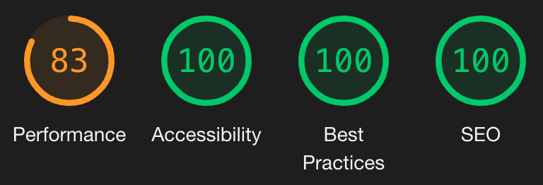

# TitanStar Legends - Talent Calculator

This project is a first pass at building the talent calculator for TitanStar Legends. As this project is not yet complete, some key details on next steps of implementation and current state are detailed below.

## Overview

As areas of focus for this application, I chose to specifically lean into showing decisions around accessibility accommodations, and scaleable architecture decisions prodominantly.

## Testing

This project was testing on modern evergreen browsers, as well as the Apple VoiceOver screen reader and standard tab-navigation keyboard controls for accessibility purposes. Additionally, Google Lighthouse and ESLint were used as a general guide for developing accessibly, performantly, and with best practices.

Unit testing would use Jest and follow the single responsibility principle, focusing on the capabilities and limitations of individual methods. Selenium tests (written in NodeJS) would be used for UI and integration tests.

For cross-browser testing, I prefer Browserstack for the wide range of options for testing available, and the integrations with Selenium for automating UI and integration tests.

For visual regression testing, BackstopJS would be used to ensure visual elements do not shift as features would be added in the future, such as additional talent trees or other interfaces.

### Google Lighthouse report run in Production Mode

The main cause of Lighthouse's 83 percent performance score is due to render-blocking resources, which could be resolved by::

- Server-side rendering
- Splitting critical CSS/JS into chunks that could be included in the HTML as inline code, while lazy loading the remaining assets after render.

### A note on accessibility:

An opportunity for a11y improvements for this component would be the ability to "right click" using a keyboard for non-mouse users, such as those who use "suck and puff" accessibility devices for navigating the web. Windows allows non-screen reader keyboard users to use shift-F10 to activate the context menu, but MacOS doesn't by default allow this.

As an alternative, having a hidden button that's only accessible via tab navigation (much like a skip link) would allow Mac keyboard users to still be able to remove talent points, and comply with the WCAG 2.1 AA specification The available scripts for this project are below.

## State management

State for this project would be initialized using the default state defined in `consts.js`. Click and context click events would be handled by the buttons themselves, which would be passed back up to the TalentWrapper component, which serves as the state managing parent component. The Context API would be used to provide broader access to state to all buttons and the TalentCounter component, so that they update accordingly when the state changes.

Upon receiving the need to change state, the TalentWrapper component would update the state for which buttons are selected, selectable, and not selectable, as well as the number of points used per tree and total points used. The number of points used per tree would be used to determine whether or not the TalentConnector components would need to rerender, changing their classes to appear highlighted or dimmed accordingly.

## Styles

The application would be built using the mobile-first approach, using the breakpoint values outlined in `variables.scss` in conjunction with a media query SCSS mixin for ease of implementation. The page layout would be refactored to use either CSS Grid or Flexbox to manage component reflow and columns. Ideally, the TalentCounter would be sticky, floating to the right of the TalentPaths to allow the user to always see their available and spent points while scrolling.

## Architecture

While this project is fairly small, I chose to treat it like the beginning of a much larger application, including the sorts of project scaffolding, structure, and front-end utilities.

You will see there are directories for both Views and Contexts, which have not yet been implemented - while only one view exists, and likewise one major UI component, the goal was to give a sense of how these single entities would exist in a larger ecosystem.

This project was bootstrapped with [Create React App](https://github.com/facebook/create-react-app).

## Available Scripts

In the project directory, you can run:

### `yarn start`

Runs the app in the development mode.\
Open [http://localhost:3000](http://localhost:3000) to view it in the browser.

The page will reload if you make edits.\
You will also see any lint errors in the console.

### `yarn test`

Launches the test runner in the interactive watch mode.\
See the section about [running tests](https://facebook.github.io/create-react-app/docs/running-tests) for more information.

### `yarn build`

Builds the app for production to the `build` folder.\
It correctly bundles React in production mode and optimizes the build for the best performance.

The build is minified and the filenames include the hashes.\
Your app is ready to be deployed!

See the section about [deployment](https://facebook.github.io/create-react-app/docs/deployment) for more information.

### `yarn eject`

**Note: this is a one-way operation. Once you `eject`, you can’t go back!**

If you aren’t satisfied with the build tool and configuration choices, you can `eject` at any time. This command will remove the single build dependency from your project.

Instead, it will copy all the configuration files and the transitive dependencies (webpack, Babel, ESLint, etc) right into your project so you have full control over them. All of the commands except `eject` will still work, but they will point to the copied scripts so you can tweak them. At this point you’re on your own.

You don’t have to ever use `eject`. The curated feature set is suitable for small and middle deployments, and you shouldn’t feel obligated to use this feature. However we understand that this tool wouldn’t be useful if you couldn’t customize it when you are ready for it.

## Learn More

You can learn more in the [Create React App documentation](https://facebook.github.io/create-react-app/docs/getting-started).

To learn React, check out the [React documentation](https://reactjs.org/).

### Code Splitting

This section has moved here: [https://facebook.github.io/create-react-app/docs/code-splitting](https://facebook.github.io/create-react-app/docs/code-splitting)

### Analyzing the Bundle Size

This section has moved here: [https://facebook.github.io/create-react-app/docs/analyzing-the-bundle-size](https://facebook.github.io/create-react-app/docs/analyzing-the-bundle-size)

### Making a Progressive Web App

This section has moved here: [https://facebook.github.io/create-react-app/docs/making-a-progressive-web-app](https://facebook.github.io/create-react-app/docs/making-a-progressive-web-app)

### Advanced Configuration

This section has moved here: [https://facebook.github.io/create-react-app/docs/advanced-configuration](https://facebook.github.io/create-react-app/docs/advanced-configuration)

### Deployment

This section has moved here: [https://facebook.github.io/create-react-app/docs/deployment](https://facebook.github.io/create-react-app/docs/deployment)

### `yarn build` fails to minify

This section has moved here: [https://facebook.github.io/create-react-app/docs/troubleshooting#npm-run-build-fails-to-minify](https://facebook.github.io/create-react-app/docs/troubleshooting#npm-run-build-fails-to-minify)
